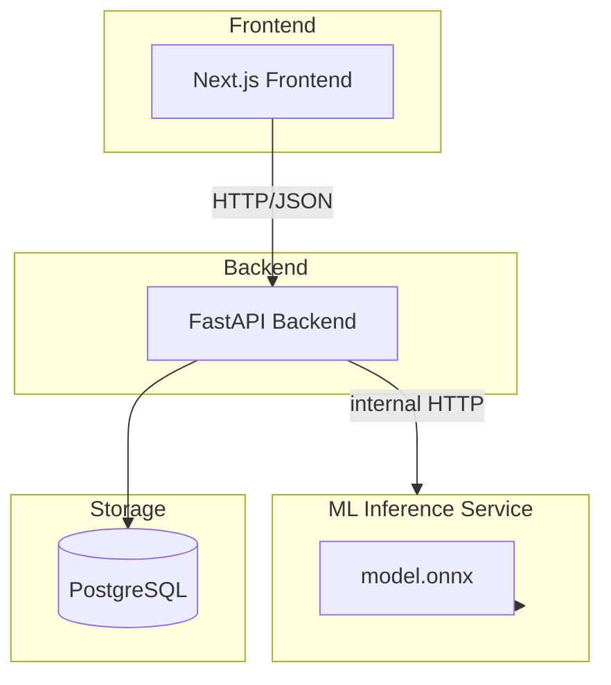

# ClauseGuard

**NLP-powered contract clause analysis and concern detection.**

[](https://github.com/AdemGhalleb/ClauseGuard/actions/workflows/ci.yml)

ClauseGuard is a production-oriented NLP system that extracts and classifies individual clauses from contracts, then evaluates those clauses against a documented set of configurable checks to surface *potentially concerning provisions* for human review.

ClauseGuard is **not** an "AI lawyer," a legal-advice system, or an LLM wrapper. It is a supervised NLP and backend-engineering project that treats contract analysis as two separate problems: **clause classification** (what kind of clause is this?) and **checklist evaluation** (does this clause trigger a documented check?).

---

## Overview

A user uploads a PDF or DOCX contract. ClauseGuard:

1. extracts the text,
2. segments it into clauses/sections,
3. classifies each clause with a supervised NLP model,
4. evaluates each clause against a documented checklist,
5. presents the results as structured findings in a dashboard.

Classification alone does not say whether a contract is "good" or "bad." ClauseGuard separates the *what* (a non-compete clause, confidence 0.94) from the *so what* (duration of five years exceeds the configured checklist threshold of one year → **flagged for review**). Findings are always reported as checklist-based potential concerns, never as legal conclusions.

## Problem

Contracts are long, repetitive, and information-dense. Reviewing them for specific concerns is slow and requires knowing where to look. Most public discussion of "contract AI" overpromises — chatbots that claim to judge legality or produce opaque "risk scores."

ClauseGuard takes the opposite approach: narrow, measurable NLP tasks with transparent, configurable evaluation logic. The first real ML problem is a supervised multi-class classification task:

> Given a contract provision, classify it into its clause category.

A separate, rule-based evaluation layer then applies explicitly documented checks.

## How It Works

```mermaid
flowchart LR
    A[PDF / DOCX] --> B[Text extraction]
    B --> C[Clause / section segmentation]
    C --> D[Clause classification\n(supervised NLP)]
    D --> E[Checklist evaluation\n(rule-based, V1)]
    E --> F[Structured findings]
    F --> G[Analysis dashboard]
```

### Running example

Input clause:

> "The employee agrees that for a period of five years following termination, they shall not provide services to any competing business."

The NLP model identifies the clause type:

```json
{
  "clause_type": "non_compete",
  "confidence": 0.94
}
```

A separate evaluation layer inspects the clause and reports:

```text
non-compete duration = 5 years
configured checklist threshold = 1 year
potential concern = true (flagged for review)
```

ClauseGuard explains that this is a **potential concern according to a configured checklist** — it does not declare the provision illegal.

## Machine Learning

The project deliberately follows an ML progression from baseline to production artifact rather than jumping straight to a transformer.

| Phase | Approach | Purpose |
| --- | --- | --- |
| 1 | TF-IDF + Logistic Regression | Cheap, interpretable classical baseline |
| 2 | Transformer-based classifier (candidate: DistilBERT or a legal-domain model — to be evaluated) | Fine-tuned model, compared against the baseline |
| 3 | Export / optimization → ONNX → inference service | Deployable model artifact |

We will not claim ahead of time which model wins; the comparison is the experiment.

**Primary metric:** macro-F1, because the label distribution is imbalanced and a metric that treats every class equally is more informative than accuracy alone. We also report accuracy, macro/weighted F1, precision/recall, per-class F1, confusion matrices, and — for serving — inference latency, model size, and memory usage.

**Evaluation integrity:** clauses originating from the same contract must not leak across train/test splits in a way that makes evaluation artificially optimistic. Document-level splitting is treated as a first-class requirement. Trustworthy evaluation matters more than an impressive-looking number.

> **Status:** No models have been trained yet. All experimental results are placeholder / TBD and will be filled in after experiments run.

See [docs/ml-pipeline.md](docs/ml-pipeline.md) and [docs/dataset.md](docs/dataset.md).

## Architecture



- **Next.js** — document upload, analysis dashboard, clause visualization, findings, analysis history.
- **FastAPI** — auth, document management, upload handling, orchestration, persistence, frontend API, communication with the ML service.
- **ML inference service** — a narrow service: text/clauses in, predictions out. It owns no users, auth, history, or frontend concerns.
- **PostgreSQL** — application state only: users, documents, clauses, analyses, model versions. The trained neural model is *not* stored in the database.

Model versions are recorded with each analysis so old results can be traced to the model that produced them.

See [docs/architecture.md](docs/architecture.md) for detailed component responsibilities.

## Dataset

The first dataset is **LEDGAR**, accessed through the **LexGLUE** benchmark.

- **LexGLUE** is the benchmark containing several legal NLP datasets.
- **LEDGAR** is the dataset/task ClauseGuard primarily uses for V1. It consists of labeled *contract provisions* (paragraphs), not complete contracts.
- **ContractNLI** and **CUAD** are not required for V1. CUAD may be useful later for span/evidence extraction.

For the experiment design, dataset structure, and verified statistics, see [docs/dataset.md](docs/dataset.md).

## Tech Stack

Planned (V1):

- **ML training:** Python, scikit-learn (baseline), PyTorch + Hugging Face Transformers (candidate transformer), ONNX / ONNX Runtime (export + serving)
- **Backend:** FastAPI, Python
- **Frontend:** Next.js
- **Database:** PostgreSQL
- **Document processing:** PyMuPDF (PDF), python-docx (DOCX)
- **Serving:** Docker images; the trained model is exported as `model.onnx` in the inference-service image

Intentionally **not** in V1: Kubernetes, Kafka, gRPC, vector databases, RAG, Redis, multi-agent systems, and LLM-based contract analysis as the core ML system. These will be added only if a concrete requirement justifies them.

## Roadmap

Planned milestones:

1. **Dataset** — acquire LEDGAR, inspect, analyze class distribution, select categories, preprocess
2. **Baseline** — TF-IDF + Logistic Regression, evaluation, error analysis
3. **Transformer** — fine-tune, compare against baseline, error analysis, model selection
4. **Model serving** — export to ONNX, inference API, Docker
5. **Application** — document extraction, clause segmentation, FastAPI, PostgreSQL, frontend
6. **Evaluation layer** — documented checklist, rule-based checks, structured findings
7. **Advanced** — concern classifier, evidence highlighting, optional LLM explanations and semantic search

See [docs/roadmap.md](docs/roadmap.md).

## Responsible Use

ClauseGuard is an experimental software and NLP system for document analysis and research purposes. Its findings are based on trained models and configurable checklists and should not be interpreted as legal advice, legal conclusions, or a substitute for professional legal review.

The project deliberately avoids claiming that it "detects illegal clauses," "determines whether a contract is safe," "replaces lawyers," or "guarantees legal compliance." It reports **potential concerns**, **flags provisions for review**, and produces **checklist-based findings** with **model predictions** and **classification confidence** — nothing more.

## Future Extensions (V2/V3)

- **LLM-powered explanations** of structured findings in natural language
- **Question answering** over extracted contract information
- **Semantic search / RAG**: "Find every clause related to termination," "Show me the clauses concerning liability"
- A second ML model for concern/checklist classification (only with a defensible labeling methodology)

The system must remain fully useful without an LLM; these are additive features, not the core.

## Project Structure

```
ClauseGuard/
├── README.md
├── docs/
│   ├── architecture.md
│   ├── ml-pipeline.md
│   ├── dataset.md
│   └── roadmap.md
```

This repository currently contains documentation only. Application code (training scripts, services, frontend) will be added as the project progresses. The structure above will grow to reflect that code.

## CI / CD (GitHub Actions)

[](https://github.com/AdemGhalleb/ClauseGuard/actions/workflows/ci.yml)

One workflow, [`.github/workflows/ci.yml`](.github/workflows/ci.yml), runs on every push to `main` and on every pull request:

```text
      push / PR
         ↓
  GitHub Actions
         ↓
  ┌──────────────┐
  │   structure   │   always runs — docs + required files
  │     python    │   activates when Python config appears
  │   frontend    │   activates when package.json appears
  │    docker     │   activates when a Dockerfile appears
  └──────────────┘
         ↓
      merged
```

Design rules:

- **Checks activate only for components that actually exist.** Today the repo is documentation-only, so `structure` is the only job that runs; the Python, frontend, and Docker jobs report as **skipped** (not failed) until their config files appear.
- **Deployment (CD) is intentionally absent** — there is no hosting target yet. See [docs/ci-cd.md](docs/ci-cd.md) and the CI/CD checklist in [docs/roadmap.md](docs/roadmap.md).

## Development

There is no application code yet, so there are no setup or run commands to document. As the codebase is built, this section will gain installation and usage instructions for:

- the ML training environment (Python; baseline + transformer experiments),
- the inference service (Docker image containing `model.onnx`),
- the FastAPI backend and Postgres schema,
- the Next.js frontend.

The immediate next engineering step is to **load and inspect the LEDGAR dataset before writing any classifier** — see [docs/dataset.md](docs/dataset.md) and Milestone 1 in [docs/roadmap.md](docs/roadmap.md).

---

*ClauseGuard is an experimental research and engineering project. See the disclaimer above.*