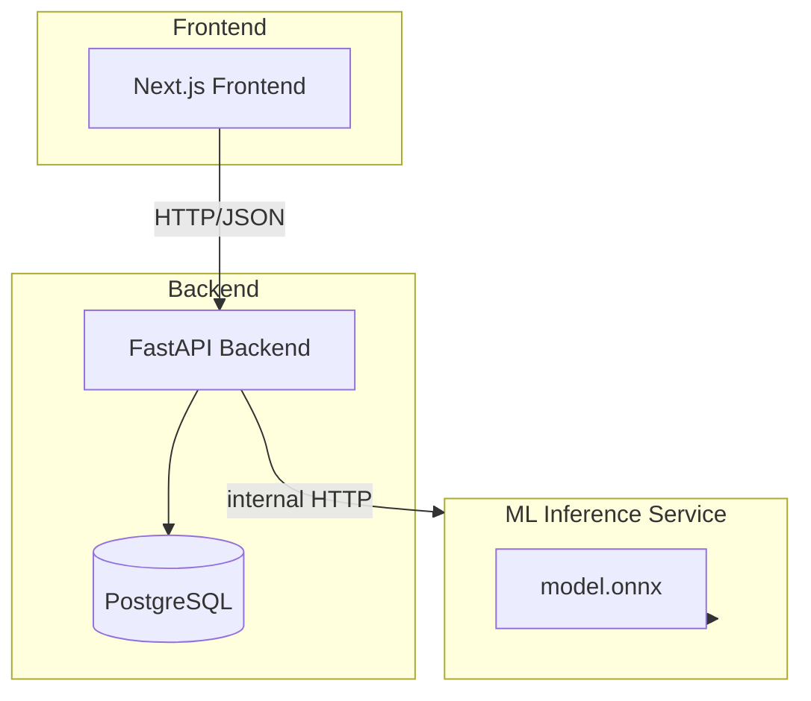
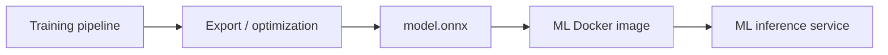

# Architecture

This document describes the planned architecture for ClauseGuard. The system is currently in the documentation phase; nothing below has been implemented yet. Component boundaries are defined up front so that later implementation work is guided by explicit responsibilities.

## System Components



| Component | Responsibility |
| --- | --- |
| Next.js frontend | Document upload, analysis dashboard, clause visualization, findings, analysis history |
| FastAPI backend | Authentication, document management, upload handling, orchestration, persistence, API for the frontend, communication with the ML service |
| ML inference service | A narrow text-in / predictions-out service wrapping an exported ONNX model |
| PostgreSQL | Application state: users, documents, clauses, analyses, model versions |

## Component Responsibilities and Boundaries

### Next.js Frontend

The frontend is a thin client. It:

- uploads documents,
- renders the analysis dashboard (clauses, predicted types, confidences, findings),
- displays analysis history.

It performs no ML inference and contains no model logic. Everything it needs comes from the FastAPI backend as JSON over HTTP.

### FastAPI Backend

The backend is the application orchestrator. It:

- handles authentication,
- manages document upload and persistence,
- stores raw document text and extracted clauses,
- calls the ML inference service to obtain clause classification predictions,
- runs the checklist evaluation layer against classified clauses,
- persists analyses and associates them with the model version that produced them,
- exposes the HTTP/JSON API consumed by the frontend.

The backend is the only component that may talk to the ML service and to PostgreSQL.

### ML Inference Service

The inference service deliberately has a narrow scope:

```text
text / clauses
→ model
→ predictions
```

It does **not** own users, authentication, application history, document storage, or frontend concerns. Keeping this service narrow serves two purposes:

1. **Deployability** — the service can be built purely around an exported model artifact and swapped or scaled independently of application logic.
2. **Boundary of trust** — application features cannot accidentally creep into the model path, and vice versa.

The service wraps a model exported as `model.onnx` and exposes a minimal prediction interface (an internal HTTP endpoint; exact contract TBD).

### PostgreSQL

PostgreSQL stores application state and analysis history:

- `users`
- `documents`
- `clauses`
- `analyses`
- `model_versions`

Each clause may eventually carry its raw text, clause index, predicted type, classification confidence, concern status, and the model version that produced the prediction. Model versioning is preserved so that old analyses can be associated with the model that produced them.

The database does **not** store the trained neural model. The model lives in the inference service as a file artifact inside a Docker image.

## Communication Between Components

- Frontend ↔ Backend: HTTP/JSON over the FastAPI API. Exact endpoints TBD and will be documented as they are implemented.
- Backend ↔ ML service: internal HTTP request/response, carried over the internal network (not exposed from the frontend).
- Backend ↔ PostgreSQL: standard database client connection.

No asynchronous message bus exists in V1. If asynchronous processing becomes necessary (e.g., long-running document analysis), a queue may be introduced — only when a concrete requirement justifies it.

## Model Artifact Lifecycle

The trained model is an artifact produced by the training pipeline and consumed by the inference service — it is not embedded in the frontend or treated as a magical component.



1. The training pipeline produces a trained model (Phase 2 in [ml-pipeline.md](ml-pipeline.md)).
2. The model is exported and optimized to ONNX (`model.onnx`).
3. The ONNX artifact is baked into an ML Docker image.
4. The inference service runs that image and serves predictions.

## Why ML Inference Is Separated from the Backend

- **Different deployment lifecycle.** The model changes with every experiment; the application changes with feature work. A separate service lets the model update, roll back, and be measured (latency, size, memory) independently.
- **Different resource profile.** GPU or high-CPU use for inference should not compete with the web backend.
- **Clear ownership.** Application developers and ML practitioners have distinct interfaces to the same system, reducing accidental entanglement.
- **Honest boundaries.** A narrow service makes the model's inputs and outputs explicit: text in, predictions out.

## Why PostgreSQL Exists

The application produces reproducible, auditable analysis history. Users, uploaded documents, extracted clauses, and analyses persist across sessions, and every analysis records the model version that produced it. A relational database is the straightforward fit for this structured, relationship-heavy state. It is not used as a vector store, and the model itself deliberately lives outside it.

## Document Processing Pipeline

Documents travel through the backend before classification:

```text
PDF/DOCX
→ text extraction (PyMuPDF for PDF, python-docx for DOCX)
→ normalization
→ clause/section segmentation
→ individual clauses
→ NLP classification
```

- V1 supports native digital PDF and DOCX. OCR / scanned documents are explicitly out of scope for V1.
- Clause segmentation is expected to be one of the more difficult engineering problems. Initial techniques will draw on paragraph boundaries, numbered sections, headings, regex, sentence splitting, and structural patterns. We do not assume perfect segmentation is solved.

## Intentionally Omitted Infrastructure

These are deliberately excluded from V1. Each may be added later only if a concrete requirement justifies it:

- Kubernetes
- Kafka / event streaming
- gRPC
- Vector database / RAG
- Redis (unless asynchronous processing actually requires it)
- Complex multi-agent systems
- LLM-based contract analysis as the core ML system

This is a deliberate choice to avoid architecture theater: components that solve problems the system does not yet have.

## Status

Components, responsibilities, and boundaries above are design decisions for the implementation phase. Implementation order is tracked in [roadmap.md](roadmap.md).