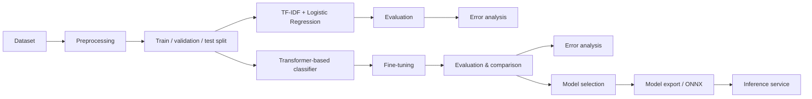

# ML Pipeline

This document describes the planned machine-learning pipeline for ClauseGuard's first task: supervised multi-class classification of contract provisions into clause categories.

> **Important:** No experiments have been run yet. Every result in this document is a placeholder (`TBD`) and will be filled in with real numbers as experiments are executed. We will not publish fabricated or premature results.

## Task

Given a contract provision (a clause/paragraph of text), predict its clause category.

- Problem type: supervised multi-class text classification
- Primary metric: **macro-F1** (the label distribution is imbalanced; a metric that weighs each class equally is the most honest summary)
- Supporting metrics: accuracy, macro-/weighted-F1, precision, recall, per-class F1, confusion matrix

## Pipeline Overview



## Phase 1 — Baseline: TF-IDF + Logistic Regression

The first experiment is a classical, cheap, and interpretable baseline. Its purpose is to establish a reference point for clause classification before introducing a transformer.

Steps:

1. Preprocess LEDGAR provision text (exact normalization steps TBD after dataset inspection).
2. Convert text to TF-IDF features.
3. Train a logistic regression classifier.
4. Evaluate with the documented metric set.
5. Perform error analysis: examine per-class F1, the confusion matrix, and representative misclassified provisions.

Expected outputs:

| Artifact | Status |
| --- | --- |
| Preprocessing + feature pipeline | Planned |
| Baseline model checkpoint | Planned |
| Evaluation report (macro-F1, per-class F1, confusion matrix) | TBD — after experiments |
| Error analysis notes | TBD — after experiments |

## Phase 2 — Transformer-based Classifier

The baseline is compared against a fine-tuned transformer classifier.

Candidate models: DistilBERT or a legal-domain transformer (for example, a LegalBERT variant). **The choice is not decided in advance** — it will be selected based on experimentation, development-set performance, and practical constraints (size, latency, qualitative error analysis).

Steps:

1. Tokenize provisions with the chosen tokenizer.
2. Fine-tune the transformer classifier.
3. Evaluate with the same metric set as the baseline.
4. Error analysis: compare failure patterns against the baseline (e.g., which classes the transformer fixes vs. still gets wrong).
5. Model selection: transformer chosen only if the improvement justifies its cost (size, inference latency, complexity).

Expected outputs:

| Artifact | Status |
| --- | --- |
| Fine-tuning pipeline | Planned |
| Fine-tuned model checkpoint | TBD |
| Comparison table vs. baseline | TBD — after experiments |
| Selected model + rationale | TBD — after experiments |

## Phase 3 — Model Export and Serving

The selected trained model becomes a deployable artifact:

```text
trained model
→ export / optimization
→ model.onnx
→ ML Docker image
→ inference service
```

Steps:

1. Export the trained model to ONNX.
2. Optimize / quantize where the evaluation supports it (measured trade-offs only).
3. Measure serving characteristics: inference latency, model size, memory usage.
4. Wrap `model.onnx` in a minimal inference service (see [architecture.md](architecture.md)).
5. Validate that the exported model's predictions match the training-time model within an acceptable tolerance.

Expected outputs:

| Artifact | Status |
| --- | --- |
| `model.onnx` artifact | TBD |
| Inference service | Planned (Milestone 4) |
| Latency / size / memory measurements | TBD — after experiments |

## Evaluation Methodology

Metrics are computed on the held-out test set only. The validation set is used for hyperparameter tuning and early stopping; the test set is touched once.

### Leakage and Splitting

- LEDGAR provisions originate from source contracts (identified by `source` document fields — see [dataset.md](dataset.md)).
- Provisions from the same source contract must be kept together when splitting. **Document-level splitting is a hard requirement**, not an option.
- Where the dataset ships with a chronology (as the LexGLUE formulation does — see [dataset.md](dataset.md)), we will evaluate on the chronological test split and additionally assess whether document-level grouping is sufficient to control leakage in our preprocessing.
- If a naive per-provision random split looks better than a document-grouped split, that difference is *evidence of leakage risk*, not a reason to prefer the optimistic number.

### Metrics

- Accuracy
- Macro-F1 (primary)
- Weighted-F1
- Precision / recall
- Per-class F1
- Confusion matrix
- For serving: inference latency, model size, memory usage

All experiment results will be recorded in this repository after they are produced.

## Constraints and Principles

- **No fabricated results.** Every table in this repo will contain either real numbers or explicit `TBD`.
- **No premature model claims.** We do not know which model wins until the comparison runs.
- **Comparative evaluation.** Every metric is meaningful only relative to the baseline and the evaluation setup; we report the full context.
- **Error analysis is a deliverable.** Understanding *why* the model fails is part of accepting the model.