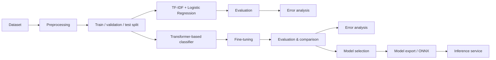

# ML Pipeline

This document describes the machine-learning pipeline for ClauseGuard's first task: supervised multi-class classification of contract provisions into clause categories.

> **Status:** The dataset audit and evaluation infrastructure phase is complete
> (see [dataset.md](dataset.md) and [evaluation.md](evaluation.md)). No
> classifier has been trained yet; every model result in this document is still
> `TBD` and will be filled in with real numbers as experiments are executed. We
> will not publish fabricated or premature results.

## Shared evaluation harness

All classifiers (the TF-IDF baseline and any later transformer) are evaluated
with one small, model-agnostic harness in `ml/src/evaluation/`:

- `classification_metrics` — accuracy, macro-F1 (primary), weighted-F1.
- `per_class_metrics` — per-class precision / recall / F1 / support.
- `top_k_metrics` — top-1 / top-3 / top-5 accuracy from probability **or**
  decision-score arrays (`LogisticRegression.predict_proba` and
  `LinearSVC.decision_function` work with the same call).
- `confusion_matrix_data` / `top_confused_pairs` — full 100×100 confusion
  matrix and sorted top-N confused label pairs.
- `ExperimentMetadata` / `EvaluationResult` — structured, JSON-serializable
  experiment records (model, dataset revision, configuration, seed, and an
  optional `git_commit` that never breaks CI when unavailable).

The evaluation protocol and metric rationale are defined in
[evaluation.md](evaluation.md).

## Task

Given a contract provision (a clause/paragraph of text), predict its clause category.

- Problem type: supervised multi-class text classification
- Primary metric: **macro-F1** (the label distribution is imbalanced; a metric that weighs each class equally is the most honest summary)
- Supporting metrics: accuracy, macro-/weighted-F1, precision, recall, per-class F1, confusion matrix

## Pipeline Overview



## Dataset Audit (done)

Before any modelling, the cached dataset was audited:

- `ml/src/audit_labels.py` — label metadata, 100-class support table, rare-class
  buckets, representative examples.
- `ml/src/audit_leakage.py` — raw + normalized exact overlap, TF-IDF
  near-duplicate similarity (fit on train only, sparse batched), top-100
  suspicious pairs, similarity buckets.
- `ml/src/normalization.py` — conservative deterministic normalization
  preserving digits and legal tokens.

Empirical findings are recorded in [dataset.md](dataset.md). Generated reports
live in `ml/reports/` (gitignored). The audit confirmed: all 100 classes are
present and strongly imbalanced; raw exact-text overlap between splits is zero,
but normalized exact matches (boilerplate) and very high TF-IDF similarity
(≈5% of validation/test ≥ 0.9999) are widespread. LexGLUE does not expose
contract IDs, so document-level splits cannot be verified from this package.

## Phase 1 — Baseline: TF-IDF + Logistic Regression

The first experiment is a classical, cheap, and interpretable baseline. Its purpose is to establish a reference point for clause classification before introducing a transformer.

Steps:

1. Preprocess LEDGAR provision text (exact normalization steps TBD after dataset inspection).
2. Convert text to TF-IDF features.
3. Train a logistic regression classifier.
4. Evaluate with the documented metric set.
5. Perform error analysis: examine per-class F1, the confusion matrix, and representative misclassified provisions.

Expected outputs:

| Artifact | Status |
| --- | --- |
| Preprocessing + feature pipeline | Planned |
| Baseline model checkpoint | Planned |
| Evaluation report (macro-F1, per-class F1, confusion matrix) | TBD — after experiments |
| Error analysis notes | TBD — after experiments |

## Phase 2 — Transformer-based Classifier

The baseline is compared against a fine-tuned transformer classifier.

Candidate models: DistilBERT or a legal-domain transformer (for example, a LegalBERT variant). **The choice is not decided in advance** — it will be selected based on experimentation, development-set performance, and practical constraints (size, latency, qualitative error analysis).

Steps:

1. Tokenize provisions with the chosen tokenizer.
2. Fine-tune the transformer classifier.
3. Evaluate with the same metric set as the baseline.
4. Error analysis: compare failure patterns against the baseline (e.g., which classes the transformer fixes vs. still gets wrong).
5. Model selection: transformer chosen only if the improvement justifies its cost (size, inference latency, complexity).

Expected outputs:

| Artifact | Status |
| --- | --- |
| Fine-tuning pipeline | Planned |
| Fine-tuned model checkpoint | TBD |
| Comparison table vs. baseline | TBD — after experiments |
| Selected model + rationale | TBD — after experiments |

## Phase 3 — Model Export and Serving

The selected trained model becomes a deployable artifact:

```text
trained model
→ export / optimization
→ model.onnx
→ ML Docker image
→ inference service
```

Steps:

1. Export the trained model to ONNX.
2. Optimize / quantize where the evaluation supports it (measured trade-offs only).
3. Measure serving characteristics: inference latency, model size, memory usage.
4. Wrap `model.onnx` in a minimal inference service (see [architecture.md](architecture.md)).
5. Validate that the exported model's predictions match the training-time model within an acceptable tolerance.

Expected outputs:

| Artifact | Status |
| --- | --- |
| `model.onnx` artifact | TBD |
| Inference service | Planned (Milestone 4) |
| Latency / size / memory measurements | TBD — after experiments |

## Evaluation Methodology

Metrics are computed with the shared harness (`ml/src/evaluation/`). The
validation set is used for model comparison, hyperparameter selection, and
threshold selection; the test set is touched exactly once per frozen model.
Full discipline and metric rationale: [evaluation.md](evaluation.md).

### Evaluation protocol

1. Fit the vectorizer and classifier on **train only**.
2. Select the best model/configuration on **validation** using macro-F1
   (primary), with accuracy, weighted-F1, top-k, and per-class metrics as
   supporting views.
3. Produce error analysis (per-class F1, confusion matrix, top confused pairs)
   on **validation**.
4. Once frozen, run the chosen model on **test** and record the full metric
   set and an `EvaluationResult` JSON.

### Similarity-stratified evaluation (future)

The leakage audit stores per-example maximum cosine-similarity-to-train arrays
and standard buckets (`<0.50`, `0.50–0.80`, `0.80–0.90`, `0.90–0.95`,
`0.95–0.98`, `>=0.98`) in `ml/reports/`. After the baseline exists, evaluation
metrics will be reported per bucket to show which provisions the model truly
generalises to versus memorises from near-duplicate boilerplate. This is
diagnostic context, **not** a model-selection criterion.

### Abstention / calibration analysis (future)

After model probabilities are available, we will evaluate calibration (ECE) and
confidence-based abstention for the drafting-assistant use case. These are
production-oriented and intentionally deferred until the baseline's output
representation is known (see [evaluation.md](evaluation.md)).

### Leakage and Splitting

- The original LEDGAR corpus has source contracts, but the inspected LexGLUE
  package exposes only `text` and `label`; it has no source-document field (see
  [dataset.md](dataset.md)).
- If source identifiers are obtained, provisions from the same source contract
  must be kept together. **Document-level splitting remains a hard
  requirement** for any evaluation setup where such identifiers are available.
- We will use the provided chronological splits and report their exact-text
  overlap. Source-level grouping cannot be verified until a source with
  contract IDs is selected.
- If a naive per-provision random split looks better than a document-grouped split, that difference is *evidence of leakage risk*, not a reason to prefer the optimistic number.

### Metrics

- Accuracy
- Macro-F1 (primary)
- Weighted-F1
- Precision / recall
- Per-class F1
- Confusion matrix
- For serving: inference latency, model size, memory usage

All experiment results will be recorded in this repository after they are produced.

## Constraints and Principles

- **No fabricated results.** Every table in this repo will contain either real numbers or explicit `TBD`.
- **No premature model claims.** We do not know which model wins until the comparison runs.
- **Comparative evaluation.** Every metric is meaningful only relative to the baseline and the evaluation setup; we report the full context.
- **Error analysis is a deliverable.** Understanding *why* the model fails is part of accepting the model.
