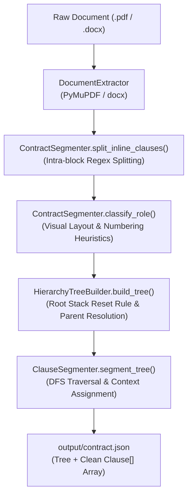

# Contract PDF Parser & Structural Hierarchy Extractor — Comprehensive Guide

## 1. Executive Summary & Goals

The **Contract PDF Parser** converts complex, unstructured contract documents (PDF/DOCX) into clean, machine-readable structured representations:
1. **Hierarchical Tree (`tree`)**: A nested JSON tree representing document hierarchy (Sections $\rightarrow$ Sub-sections $\rightarrow$ Clauses $\rightarrow$ Sub-items) linked by `parent_id`.
2. **Flat Extracted Clauses Array (`clauses`)**: A clean `Clause[]` array formatted specifically for downstream ML (LegalBERT), Information Extraction (LLMs), and RAG vector indexing.

---

## 2. Overall Pipeline Architecture

$$\text{PDF/DOCX Document} \longrightarrow \text{Layout Extractor} \longrightarrow \text{Sub-clause Splitter} \longrightarrow \text{Role Classifier} \longrightarrow \text{Tree Builder} \longrightarrow \text{DFS Tree Walker} \longrightarrow \text{JSON Output}$$



---

## 3. Module Breakdown & How It Works

### A. Data Models (`models.py`)

Defines three primary dataclasses:
1. **`DocumentBlock`**:
   - `text`: Raw block text.
   - `page`: 1-based page number.
   - `font_size`, `bold`, `italic`, `alignment`, `indent_left`: Visual layout metadata.
2. **`Clause`** (Tree Node):
   - `id`: Node identifier (e.g., `"10"`, `"10.1"`, `"10.1(a)"`).
   - `parent_id`: Parent node identifier (or `null` for root Level 1 sections).
   - `level`: Hierarchy depth level (1, 2, 3).
   - `title`: Section title string (e.g., `"10. TERMINATION OF EMPLOYMENT"`).
   - `children`: List of child `Clause` nodes.
3. **`ExtractedClause`** (Flat Array Element):
   - `clause_id`: Identifier (e.g. `"10.1"`).
   - `section_id`: Parent section ID (e.g. `"10"`).
   - `section_title`: Parent section title string (e.g. `"Termination"`).
   - `number`: Clause number (e.g. `"10.1"` or `null` for unnumbered clauses).
   - `text`: Pure contractual prose (stripped of number prefixes and repeating headers).
   - `page_start` & `page_end`: Page location bounds.

---

### B. Document Extractor (`extractor.py`)

- Uses **PyMuPDF (`fitz`)** (with `pypdf` as fallback) or **`python-docx`**.
- Strips header/footer margin noise (top/bottom 35pt margins).
- Extracts precise font height (`font_size`), font style (`bold`), and X-position (`indent_left`).

---

### C. Structural Segmenter & Role Classifier (`segmenter.py`)

- **Numbering Detection (`detect_numbering`)**:
  Detects named sections (`ARTICLE 1`, `SECTION 2:`), decimal schemes (`1.`, `1.1`, `1.1.1`), parentheticals (`(a)`, `(i)`), and bullets.
- **Inline Sub-Clause Splitting (`split_inline_clauses`)**:
  Splits concatenated sub-clauses in PDF blocks (e.g., `"1. APPOINTMENT. 1.1 The Employer engages..."`) into separate `DocumentBlock` objects.
- **Role Classifier (`classify_role`)**:
  Assigns roles based on layout features and context:
  - `HEADING`: Visual section title (bold, large font size, uppercase, or contract keyword).
  - `CLAUSE_START`: Numbered clause entry point.
  - `CONTINUATION`: Unnumbered body prose paragraph directly following a `HEADING` or `CLAUSE_START`.
  - `LIST_ITEM`: Bullet item.

---

### D. Hierarchy Tree Builder (`tree_builder.py`)

Reconstructs parent-child trees using the **Root Stack Reset Rule**:
1. **Root Stack Reset Rule**: When a Level 1 section (e.g., `10. TERMINATION OF EMPLOYMENT` or `11. NON-SOLICITATION COVENANTS`) is encountered, `parent_id` is set to `null` and the active stack is reset. Top-level sections never accidentally nest inside previous sections.
2. **Parent ID Resolution (`_determine_parent_id`)**:
   - For decimal IDs (e.g. `10.1.1`), infers parent as `10.1`.
   - For parentheticals (e.g. `(a)` under `10.1`), looks up the active stack for nearest ancestor with `level < 3`, deriving `10.1(a)` with `parent_id = "10.1"`.

---

### E. DFS Tree Walker (`clause_extractor.py`)

Walks the tree via Depth-First Search (DFS) to separate section headings from contractual clauses:

1. **Section Context Tracking**:
   When entering a section node (e.g., `10. TERMINATION OF EMPLOYMENT`), extracts `section_id = "10"` and `section_title = "TERMINATION OF EMPLOYMENT"`.
2. **Text Cleaning (`_clean_clause_text`)**:
   Strips leading number prefixes (`"10.1 "`) and repeating heading lines from `text`, leaving clean contractual prose.
3. **Preamble & Signature Filtering**:
   Filters out unnumbered preamble banners (`"EMPLOYMENT AGREEMENT"`) and signature sign-off blocks (`"SIGNATURES"`) from the `clauses` array.

---

## 4. Output JSON Schema (`output/contract.json`)

```json
{
  "document": "sample_work_contract.pdf",
  "total_blocks": 64,
  "total_nodes": 55,
  "total_clauses": 38,
  "tree": [
    {
      "id": "10",
      "parent_id": null,
      "level": 1,
      "title": "10. TERMINATION OF EMPLOYMENT",
      "text": "10. TERMINATION OF EMPLOYMENT",
      "page_start": 2,
      "page_end": 2,
      "children": [
        {
          "id": "10.1",
          "parent_id": "10",
          "level": 2,
          "title": null,
          "text": "10.1 Either party may terminate the employment relationship by giving notice...",
          "page_start": 2,
          "page_end": 2
        }
      ]
    }
  ],
  "clauses": [
    {
      "clause_id": "10.1",
      "section_id": "10",
      "section_title": "TERMINATION OF EMPLOYMENT",
      "number": "10.1",
      "text": "Either party may terminate the employment relationship by giving the notice required by applicable law or this Agreement.",
      "page_start": 2,
      "page_end": 2
    }
  ]
}
```

---

## 5. Usage & Execution

Run the CLI on any PDF or DOCX file:

```bash
# Process contract document
python pdfParser/src/main.py sample_work_contract.pdf

# Run with debug block annotations
python pdfParser/src/main.py aaa.pdf --debug

# Specify custom output path
python pdfParser/src/main.py uu.pdf -o output/uu_parsed.json
```
